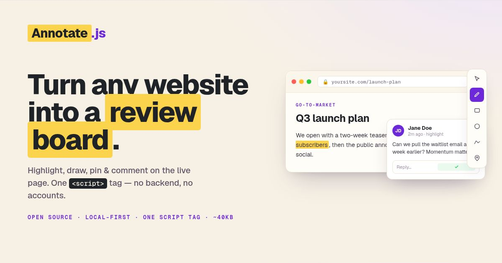

# reviewjs


**A drop-in visual review & annotation layer for any website.** Highlight text,
draw rectangles & circles, drop pins, sketch freehand and leave threaded
comments — directly on top of your live page.

By default, comments live in the visitor's own browser (`localStorage`) and
can be **downloaded to / imported from a portable JSON file**. You can also
configure your own HTTP endpoint for an explicit **Send feedback** action.

```html
<script src="https://cdn.jsdelivr.net/npm/@reviewjs/annotate/annotate.js" defer></script>
```

That single line is the whole installation.

---

## Why reviewjs?

- **One `<script>` tag.** No build step, no framework, no signup.
- **Works everywhere.** Plain HTML, React, Vue, Svelte, WordPress, Webflow,
  Shopify, static sites — anything that renders HTML in a browser.
- **Local-first & private.** Comments stay on the reviewer's device until they
  explicitly export or send feedback to an endpoint you configure.
- **Portable.** Reviewers export their feedback as JSON and send it to you; you
  import it with one click and see every note in place.
- **Polished UI.** A floating toolbar, a Figma-style comments panel, light/dark
  themes that auto-adapt to your page, and full keyboard shortcuts.
- **Dependency-free.** Vanilla JavaScript with no runtime dependencies.

---

## Features

| Tool | What it does |
|------|--------------|
| ✏️ **Highlight** | Select any text to highlight and comment on it |
| ▭ **Rectangle** | Draw a box around any region |
| ◯ **Circle** | Circle anything that needs attention |
| 📍 **Pin** | Drop a point marker anywhere |
| 〰️ **Freehand** | Sketch directly on the page |
| ➕ **Section note** | Hover any paragraph/heading for a margin comment button |

Plus: threaded replies, resolve/reopen, search & filter, deep-links to a single
comment (`#an=<id>`), an "off" mode that collapses to a small launcher, and a
**Download / Copy / Import** round-trip for sharing.

---

## Quick start

### 1. The fastest way (CDN)

Add this just before `</body>`:

```html
<script src="https://cdn.jsdelivr.net/npm/@reviewjs/annotate/annotate.js" defer></script>
```

That's it — reload the page and the toolbar appears in the bottom-right corner.

> **Pin a version** for production stability:
> `https://cdn.jsdelivr.net/npm/@reviewjs/annotate@1.5.1/annotate.js`
>
> unpkg works too:
> `https://unpkg.com/@reviewjs/annotate@1.5.1/annotate.js`

### 2. Self-hosted

Download [`annotate.js`](./annotate.js), drop it next to your HTML and:

```html
<script src="/annotate.js" defer></script>
```

---

## Configuration

Configure with `data-` attributes on the script tag — all optional:

```html
<script
  src="https://cdn.jsdelivr.net/npm/@reviewjs/annotate/annotate.js"
  data-project="marketing-site"
  data-accent="#6d28d9"
  data-theme="auto"
  data-position="bottom-right"
  data-start-open="true"
  data-note="Focus on the hero copy and pricing — flag anything off-brand."
  data-spa="true"
  data-post-url="https://feedback.example.com/feedback"
  data-share-email="https://github.com/org/repo/issues/new?title=Review%20{page}&amp;body={summary}"
  defer
></script>
```

| Attribute | Default | Description |
|-----------|---------|-------------|
| `data-project` | `""` | Namespace for stored comments. Keep separate sites apart. |
| `data-page` | `location.pathname` | Page key comments are grouped under. |
| `data-accent` | — | Brand color for primary buttons & the active tool. |
| `data-theme` | `auto` | `light`, `dark`, or `auto` (sniffs your page background). |
| `data-position` | `bottom-right` | `bottom-right` or `bottom-left`. |
| `data-blocks` | sensible default | CSS selector for "section note" (+) targets. |
| `data-start-open` | `false` | Set to `true` to show the review toolbar immediately instead of the collapsed Review pill. |
| `data-note` | — | Author's note to reviewers — what should be reviewed. Shown when they start and atop the comments panel. |
| `data-spa` | `false` | Watch `pushState`, `replaceState`, and `popstate` for page changes. |
| `data-post-url` | — | URL that receives an explicit HTTP POST of the current page's export JSON. Adds **Send feedback**. |
| `data-share-email` | — | Email address or URL template for **Share**. `{page}`, `{count}`, and `{summary}` become URL-encoded values for a prefilled GitHub, GitLab, Jira, or other issue URL. |

For programmatic setup, import the ES module and call `init(config)`:

```bash
npm install @reviewjs/annotate
```

```js
import Annotate from '@reviewjs/annotate';

Annotate.init({
  project: 'marketing-site',
  accent: '#6d28d9',
  spa: true,
  postUrl: '/feedback',
});
// Call Annotate.destroy() when unmounting or during hot reload.
```

The classic script still supports `window.AnnotateConfig` set before it loads.
For a script injected after page load, call `window.Annotate.init(config)`.
`init()` can be called again after `destroy()` without leaving listeners behind.
TypeScript declarations are included in the package.

---

### Hosted reviews (`data-api`)

With a reviewjs backend, comments sync to a review instead of staying in the
browser. The author's dashboard hands out this tag and the invite links:

```html
<script src="https://app.reviewjs.com/annotate.js"
        data-api="https://app.reviewjs.com"
        data-review-id="rvw_…" defer></script>
```

| Attribute | Meaning |
|---|---|
| `data-api` | The backend origin. Without it the page stays local-only, exactly as above. |
| `data-review-id` | The review this page belongs to. |

Reviewers arrive through a personal link, `https://your-site/page?an_invite=…`.
The token is stored for that review in the reviewer's browser and removed from
the address bar, then exchanged for a 24-hour session on every load. Only the
site addresses registered on the review may use it.

- If the landing page forwards to another page before annotate.js runs (a `/`
  stub with a meta refresh, a script redirect) and drops the query string, the
  token is recovered from the same-origin referrer, so the link still works.
  Cross-origin referrers are never used.
- When the backend refuses (link revoked or expired, review closed, address not
  registered, or no link at all), the panel says why and what to do next, and
  comments stay in the browser; Download or Copy sends them by email.
- In a synced review there is nothing to submit: the footer reads "Sent to the
  review" as soon as a comment is posted.

## Framework integration

For a bundler, install `@reviewjs/annotate`, call `init()` after mount, and
call `destroy()` on unmount. Use `spa: true` when your router changes paths
through the History API. Dynamic content is watched and re-anchored after it
renders. The classic script remains available for static pages.

### ⚛️ React (and Next.js)

Mount it once at the app root with a `useEffect`:

```jsx
// components/FeedbackLayer.jsx
import { useEffect } from "react";
import Annotate from "@reviewjs/annotate";

export default function FeedbackLayer() {
  useEffect(() => {
    Annotate.init({ project: "my-react-app", accent: "#6d28d9", spa: true });
    return () => Annotate.destroy();
  }, []);
  return null;
}
```

```jsx
// App.jsx
import FeedbackLayer from "./components/FeedbackLayer";

export default function App() {
  return (
    <>
      <FeedbackLayer />
      {/* your app */}
    </>
  );
}
```

**Next.js (App Router):** mark `FeedbackLayer` as a client component with
`"use client";` at the top, then render it inside `app/layout.jsx`.

### 🟩 Vue 3

```vue
<!-- App.vue -->
<script setup>
import { onMounted, onUnmounted } from "vue";
import Annotate from "@reviewjs/annotate";

onMounted(() => {
  Annotate.init({ project: "my-vue-app", accent: "#10b981", spa: true });
});
onUnmounted(() => Annotate.destroy());
</script>
```

For a static Vue page, the classic `<script>` tag also works in `index.html`.

### 🧩 WordPress

**Option A — no code.** Install a "header/footer scripts" plugin (e.g. *WPCode*
or *Insert Headers and Footers*) and paste this into the **footer** box:

```html
<script src="https://cdn.jsdelivr.net/npm/@reviewjs/annotate/annotate.js" data-project="my-wp-site" defer></script>
```

**Option B — theme code.** Add to your theme's `functions.php`:

```php
function reviewjs_enqueue() {
  wp_enqueue_script(
    'reviewjs',
    'https://cdn.jsdelivr.net/npm/@reviewjs/annotate/annotate.js',
    array(),
    '1.5.1',
    true // load in footer
  );
}
add_action( 'wp_enqueue_scripts', 'reviewjs_enqueue' );
```

> Tip: wrap the enqueue in `if ( current_user_can('edit_posts') )` to show the
> review tools only to logged-in editors.

### 🔷 Svelte / SvelteKit

```svelte
<!-- src/routes/+layout.svelte -->
<script>
  import { onMount } from "svelte";
  import Annotate from "@reviewjs/annotate";
  onMount(() => {
    Annotate.init({ spa: true });
    return () => Annotate.destroy();
  });
</script>

<slot />
```

### 🅰️ Angular

In `angular.json`, add to the `"scripts"` array:

```json
"scripts": [
  "https://cdn.jsdelivr.net/npm/@reviewjs/annotate/annotate.js"
]
```

### 🌐 Plain HTML / static sites / Webflow / Shopify / Squarespace

Paste before `</body>` (or into the platform's "custom code / footer" field):

```html
<script src="https://cdn.jsdelivr.net/npm/@reviewjs/annotate/annotate.js" defer></script>
```

---

## Sharing comments

Sharing is an explicit action:

1. A reviewer opens the **Comments panel** (toolbar list icon or press `A`).
2. They click **Download** (⬇) to save a `annotate-<page>-<date>.json` file.
3. They send you that file.
4. You open the same page, click **Import** (⬆), pick the file — every comment
   reappears anchored in place.

To paste feedback directly into another tool, click **Copy** to copy the same
complete, import-compatible JSON payload to the clipboard.

You can also drive this from code (see the API below).

### Send feedback to your server

Set `data-post-url` on the classic script or `postUrl` in `init(config)`.
Reviewers will see a **Send feedback** button. It POSTs the same JSON export
to your endpoint with `Content-Type: application/json`. A successful response
must have a 2xx status. Sending does not delete the browser's local comments.

```html
<script src="/annotate.js" data-post-url="https://feedback.example.com/feedback" defer></script>
```

A dependency-free Node receiver is in
[`examples/feedback-server.cjs`](./examples/feedback-server.cjs). For a local
demo, run:

```bash
ALLOWED_ORIGIN=http://localhost:4200 FEEDBACK_DIR=./feedback node examples/feedback-server.cjs
```

It listens on port `8787` by default (`PORT` overrides this), accepts
`POST /feedback`, caps each JSON body at 1 MiB, and saves an individual JSON
file per submission. Use `data-post-url="http://localhost:8787/feedback"` on a
site served from `http://localhost:4200`. Set `ALLOWED_ORIGIN` to that site's
origin for cross-origin requests. Before exposing a receiver publicly, add
your site's authentication and rate limits; the example has no login.

### Prefill an issue

`data-share-email` also accepts an issue creation URL. The values of
`{page}`, `{count}`, and `{summary}` are URL encoded before substitution.
For example:

```html
<script src="/annotate.js"
  data-share-email="https://github.com/org/repo/issues/new?title=Review%20{page}&amp;body={summary}"
  defer></script>
```

The issue link contains a short comment summary. Download or send the full
JSON when teammates need to import annotations and their anchors.

---

## JavaScript API

A global `window.Annotate` is available once the classic script loads. The
ES module exports the same controller as default, plus named `init` and
`destroy` functions. The module does not start until `init(config)` is called.

```js
Annotate.open();              // show the review layer and open the comments panel
Annotate.close();
Annotate.toggle();
Annotate.enable();            // show the review layer
Annotate.disable();           // collapse to the launcher
Annotate.setTool("highlight");// show the layer, then choose cursor | highlight | rect | circle | pen | pin
Annotate.comments();          // → array of comment objects for this page
Annotate.focus(id);           // scroll to & highlight a comment
Annotate.export();            // trigger the JSON download
Annotate.import();            // open the file picker
await Annotate.submit();      // POST the JSON export to postUrl
Annotate.refresh();           // manually re-read the current page when spa is off
Annotate.destroy();           // remove UI, observers, and event listeners
Annotate.init({ spa: true });  // start again with programmatic settings
Annotate.clear();             // delete all comments on this page (local)
Annotate.toast("Saved!");     // show a toast
Annotate.version;             // "1.5.1"
```

### Comment shape

```json
{
  "id": "c…",
  "page": "marketing-site:/pricing",
  "url": "https://example.com/pricing",
  "type": "highlight",
  "author": "Jane Doe",
  "text": "This price looks out of date.",
  "color": "#f59e0b",
  "anchor": { "exact": "…", "prefix": "…", "suffix": "…" },
  "geom": null,
  "resolved": false,
  "replies": [],
  "createdAt": "2026-06-16T10:00:00.000Z",
  "updatedAt": "2026-06-16T10:00:00.000Z"
}
```

---

## Keyboard shortcuts

| Key | Action | Key | Action |
|-----|--------|-----|--------|
| `V` | Browse | `P` | Pin |
| `H` | Highlight | `A` | Comments panel |
| `R` | Rectangle | `O` | Show / hide tools |
| `C` | Circle | `Esc` | Cancel |
| `D` | Freehand | `?` | Shortcuts card |

---

## Try it locally

```bash
git clone git@github.com:reviewjs/annotate.git
cd annotate
npm start          # serves the demo at http://localhost:4200
```

Open [`index.html`](./index.html) and start annotating. Framework examples live
in [`examples/`](./examples).

---

## Browser support

Modern evergreen browsers (Chrome, Edge, Firefox, Safari). Uses standard DOM
APIs only — no polyfills required. Gracefully no-ops where `localStorage` is
unavailable (private mode, sandboxed iframes).

---

## License

[MIT](./LICENSE) — free for personal and commercial use.
